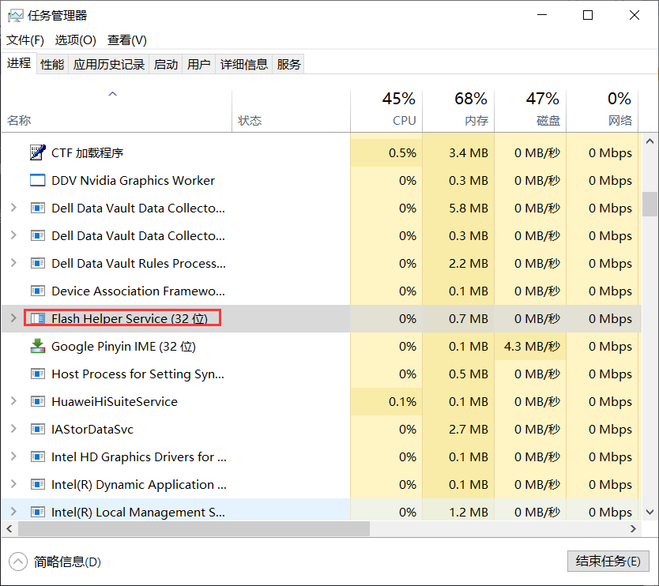
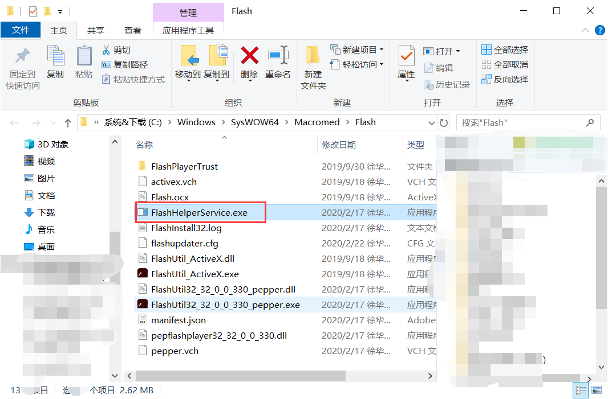
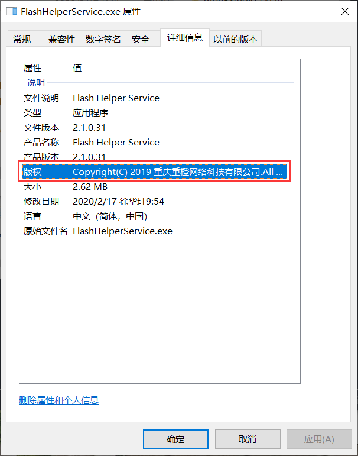
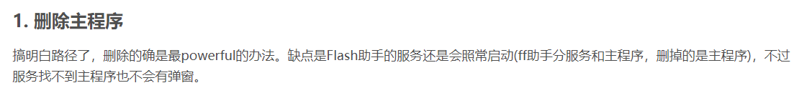
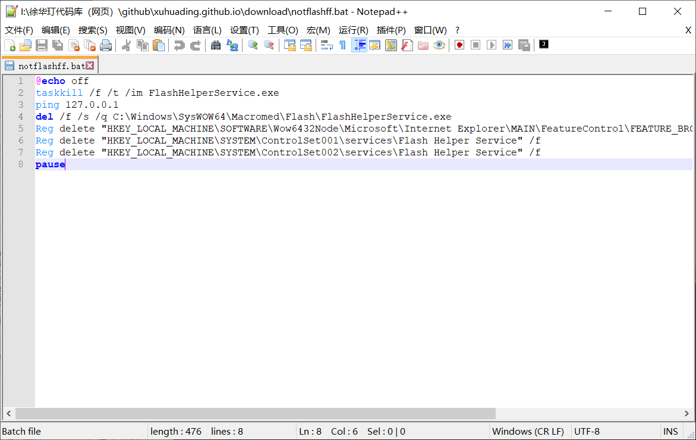

# Flash广告的消除

> 我的博客：https://xuhuading.github.io/

那些崇洋媚外的人说“外国的月亮比较圆”，那我不清楚为什么外国的flash为什么还有广告，呵呵，Adobe强制推出Flash中国特别版，添加了一些不要脸的广告，在这篇博客里，我就教大家如何杀死这些广告……

你看这是什吗玩意儿？



你会说，我知道，这是Flash的更新程序，真不错，可是它真的更新了你的flash吗？

你试着打开它试试？一堆没用的广告，可要了命了

我截一个别人博客的动图，因为我拍不下来：


最要命的是它居然还在系统目录里面，简直不要脸：



咱来看看它的文件信息😁



我怎么还觉得Adobe是美国的呢……


中国特供的，为啥不来一个津巴布韦特供，梵蒂冈特供？（没有歧视津巴布韦和梵蒂冈，不要造谣）

我们还是彻底删除的好……

你去[这里](https://xuhuading.github.io/download/notflashff.bat)下载去，这个文件直接运行即可，不清楚的人慎用



绝对没有恶意，只是修改注册表，让广告禁止启动，当然，下载不了的也可以复制下面的代码，保存为bat即可：

```bat
@echo off
taskkill /f /t /im FlashHelperService.exe
ping 127.0.0.1
del /f /s /q C:\Windows\SysWOW64\Macromed\Flash\FlashHelperService.exe
Reg delete "HKEY_LOCAL_MACHINE\SOFTWARE\Wow6432Node\Microsoft\Internet Explorer\MAIN\FeatureControl\FEATURE_BROWSER_EMULATION" /v "FlashHelperService" /f
Reg delete "HKEY_LOCAL_MACHINE\SYSTEM\ControlSet001\services\Flash Helper Service" /f
Reg delete "HKEY_LOCAL_MACHINE\SYSTEM\ControlSet002\services\Flash Helper Service" /f
pause
```

我相信你会回来的，不谢……